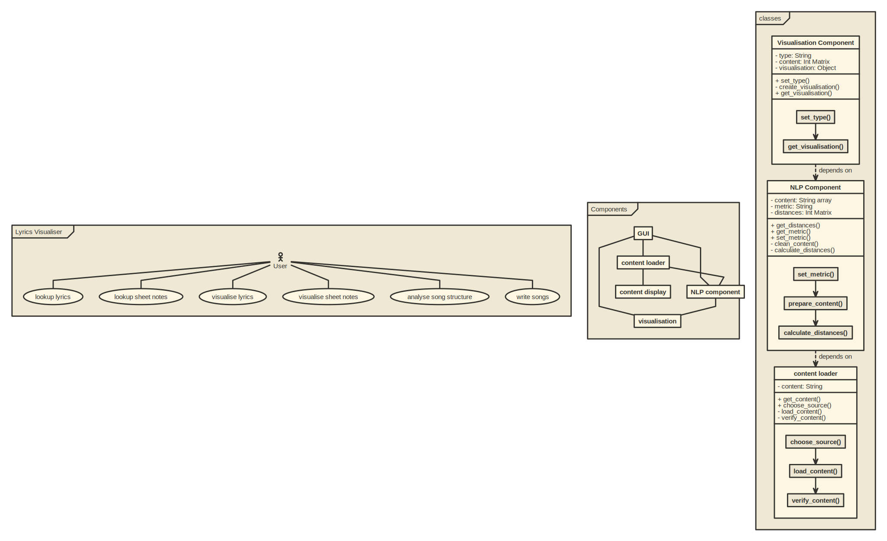

# My Docs
 
## 1. git
<a href="https://github.com/JLiekenbrock/lyrics-visualiser">1: git</a>

## 2. UML 

## 3. Event-Storming/DDD
<iframe width="768" height="432" src="https://miro.com/app/embed/uXjVOccEnLI=/?pres=1&frameId=3458764514893505685" frameBorder="0" scrolling="no" allowFullScreen></iframe>

## 4. Metrics

I used <a href="https://sonarcloud.io/summary/new_code?id=JLiekenbrock_lyrics-visualiser" target="_blank">Sonarcloud</a>, which is sonarqube in the cloud, as i wanted the whole project to be cloud based.
It also gives you the ability to embed lot's of different badges:

## 5. Clean Code

My Top 10 Clean Code Principals

1. KISS it
2. keep it DRY
3. Demeter
4. SRP
5. IOSP
6. ISP
7. SoC
8. Naming Conventions
9. DUP
10. TDD

## 6. Build Management + 8. Continuous Delivery

The build management and continuos delivery are also completely cloud based.

I used Travis for the build management and continuos delivery because all the services i use integrate extremely well with it. 

My Travis Pipeline: <a href="https://github.com/JLiekenbrock/lyrics-visualiser/blob/main/.travis.yml">travis.yml</a>

### Build Management 

The Travis Pipeline runs the unit tests by calling pytest and is also connected to sonarcloud. 
When the tests succeed this documentation is generated using the python libraries mkdocs and pdocs3.

### Continuos Delivery

When the build is successful e.g. sonarqube and pytest are happy the documentation is regenerated and published to github pages.
There is  <a href="https://jliekenbrock.github.io/lyrics-visualiser/components/index.html">technical documentation</a> generated based on the source code as well as what you are [reading right now](https://jliekenbrock.github.io/lyrics-visualiser/index.html).

[Documentation Code](https://github.com/JLiekenbrock/lyrics-visualiser/blob/main/docs/index.md)

## 7. Unit-Tests
The [Unit tests ](https://github.com/JLiekenbrock/lyrics-visualiser/tree/main/tests) are written with the help of the python library pytest.

## 9. IDE
I use visual studio code as main IDE as it has great support for my main languages, namely R and Python.
It also has integration for the Github Copilot AI, which is great in my opinion. It is especially useful when trying out new things like 
libraries, because it often comes up with useful suggestions which helps exploring things faster.
The in built explorer of vscode is also great as it easily let's you search through all files in your opened directory. You can even replace 
code across multiple files at once. 

Shortcuts i like:
Shift+Enter is very useful. It runs the selected lines of code in a python terminal in the IDE.
Otherwise i'm mostly using the standard shortcuts everyone else uses.

## 10. DSL

## 11. Functional Programming