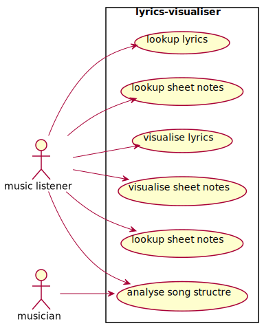
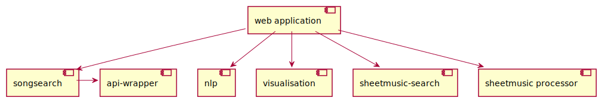
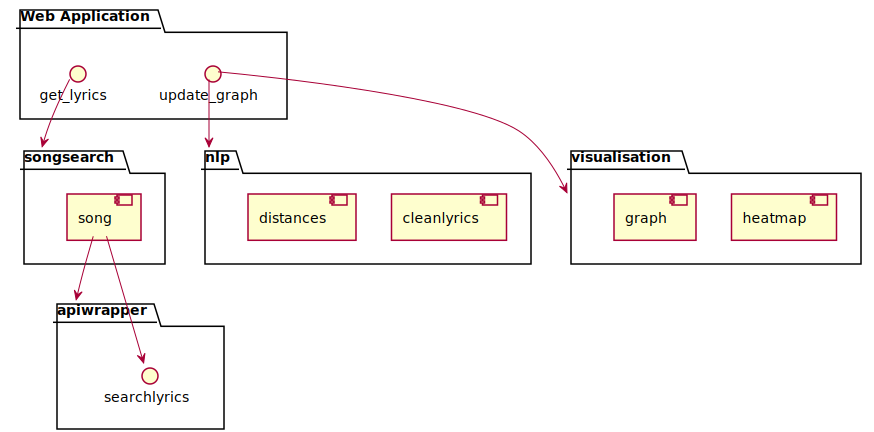

# Project Documentation
 
This is the Documentatin for my project. I ended up putting a lot of effort into the CI/CD Part as i easily get obsessed with automation.

## 1. git

<a href="https://github.com/JLiekenbrock/lyrics-visualiser">Github Repository</a>

## 2. UML 

The UML Diagrams were done with plantuml. They are rerendered using an mkdocs plantuml addon.
You can find the definitions here: <a href="https://github.com/JLiekenbrock/lyrics-visualiser/tree/gh-pages/UML">UML></a>

### Use Case Diagram

### Component Diagram

### Component Diagram with more Detail

## 3. Event-Storming/DDD
<iframe width="768" height="432" src="https://miro.com/app/embed/uXjVOccEnLI=/?pres=1&frameId=3458764514893505685" frameBorder="0" scrolling="no" allowFullScreen></iframe>

## 4. Metrics

I used <a href="https://sonarcloud.io/project/overview?id=jliekenbrock" target="_blank">Sonarcloud</a>, which is sonarqube in the cloud, as i wanted the whole project to be cloud based.
It also gives you the ability to embed lot's of different badges:

## 5. Clean Code

My Top 10 Clean Code Principle

1. DRY: 

    DRY stands for don't repeat yourself. The principle is very important in my opinion, because repition of code is easily avoidable and makes the code very hard to maintain. Two common rules to make sure to apply DRY is to define constants for values which occur frequently. 
    Another is to use functions/classes/methods which increase the abstraction level of the code, so that it becomes reusable by design. 

    As one can see by the sonarcloud repition analysis i managed not to repeate myself:
    

2. KISS:

    KISS means keep it simple stupid. Applying this principle makes sure that the code is simple to understand.
    In general it states that simple solutions should be preferred to complicated. This obviously depends on the sitation a lot.
    I mostly apply this principle when choosing frameworks for example. I decided to use pdoc, mkdocs, plantuml, pytest and travis over other solutions there are
    because all of them use very simple and straightforward code.

3. Law of Demeter (LoD) a.k.a priciple of least knowledge

    The law of demeter is paradigm in oop and is a case of loose coupling. 
    The main ideas are:
    - Each unit should have only limited knowledge about other units: only units "closely" related to the current unit.
    - Each unit should only talk to its friends; don't talk to strangers.
    - Only talk to your immediate friends.

    This is benefetial because it makes sure, that changes in one part of the software have little implications for other parts of it. It also makes programms easier to understand if there is no complex interaction between modules.

    I applied the Law of Demeter like follows: My Components don't actually know about each other.
    They are only administrated by the main program, which is dashlyrics.py.

    <a href="https://jliekenbrock.github.io/lyrics-visualiser/lyrics-visualiser/components/index.html">Components</a>

4. SRP Single-responsibility principle

    This principle states that each part of the software should only have responsibiltiy for a specific part of the 
    software and encapsulate it. The opposite of this would be a god object, like also mentioned in the ISAQB Talk.
    The pattern makes the software easier to understand and also maintainable.
    DDD really helps in using this pattern. I applied it by creating indepenedent modules for all aspects of the application.

5. ISP Interface Segregation Principle

    "No client should be forced to depend on methods it does not use."
    This means, that an interface should only implement necessary dependencies.
    I wrote two interfaces. The geniuswrapper, which is an interface to the genius api implementation i'm using.
    It implements only the necessary methods of the api implementation.
    Then there is another wrapper for this in songsearch.py which further abstracts the process.

6. Naming Conventions

    Good names are especially important in programm and often hard to find.
    A good name for an object should answer these questions:
    Why it exists?
    What does it do?
    How it is used?
    I tried to use self-explananotry names in all my code.

7. Principle of Least Surprise

    This principle comes from Interface design for users. In this context it means,
    that the user should be surprised as little as possible by the interface/application.
    When applying it to code it is related to Naming Conventions. It states, that functions/ methods names should 
    make absolutely clear what they are doing, also in terms of sideeffects. 

8. TDD: F.I.R.S.T Principles

    Testing is important in Software. And unit tests are code as well. 
    These are important rules for clean tests:
    It states that tests should be:
    Fast, Isolated/Independent, Repeatable, Self-validating, Timely
    My tests fulfill all these criteria.

9. YAGNI (Extreme Programming (XP))

    You Aren't Gonna Need It: 
    Only implement code which is absolutely necessary:
    "Always implement things when you actually need them, never when you just foresee that you need them."
    I actually noticed that i violated this principle, as i started writing code for features i anticipated.
    I never touched the code again afterwards.

10. Worse is better 

    This principle is not about clean code, but still a usefull guideline. It means, that software quality does not correlate with functioality.
    A software with less functionality (worse) might actually be more useable (better) than 
    software with more functionality.

## 6. Build Management + 8. Continuous Delivery

The build management and continuos delivery are also completely cloud based.

I used Travis for the build management and continuos delivery because all the services i use integrate extremely well with it. 

My Travis Pipeline yaml: <a href="https://github.com/JLiekenbrock/lyrics-visualiser/blob/main/.travis.yml">travis.yml</a>

### Build Management 

The Travis Pipeline runs the unit tests by calling pytest and is also connected to sonarcloud. 
When the tests succeed this documentation is generated using the python libraries mkdocs and pdocs3. 

### Continuos Delivery

When the build is successful e.g. sonarqube and pytest are happy the documentation is regenerated and published to <a href="https://github.com/JLiekenbrock/lyrics-visualiser/tree/gh-pages">github pages</a>.
There is  <a href="https://jliekenbrock.github.io/lyrics-visualiser/lyrics-visualiser/index.html">technical documentation</a> generated based on the source code as well as what you are [reading right now](https://jliekenbrock.github.io/lyrics-visualiser/index.html).

[Documentation Code](https://github.com/JLiekenbrock/lyrics-visualiser/blob/main/docs/index.md)

THe app is also deployed to <a href="http://lyricsvis.herokuapp.com/">heroku</a> on every successfull commit.

## 7. Unit-Tests
The [Unit tests ](https://jliekenbrock.github.io/lyrics-visualiser/lyrics-visualiser/tests/index.html) are written with the help of the python library pytest.

## 9. IDE
I use visual studio code as main IDE as it has great support for my main languages, namely R and Python.
It also allows you to use the <a href="https://copilot.github.com/">Github Copilot AI</a>, which is great in my opinion. It is especially useful when trying out new things like libraries, because it often comes up with useful suggestions which helps exploring things faster.
The in-built explorer of vscode is also great as it easily let's you search through all files in your opened directory. You can even replace 
code across multiple files at once. 

Shortcuts i like:
Shift+Enter is very useful. It runs the selected lines of code in a python terminal in the IDE.
Otherwise i'm mostly using the standard shortcuts everyone else uses.

## 10. DSL
I created a class that uses the style of the Cars example in moodle:
<a href="https://jliekenbrock.github.io/lyrics-visualiser/lyrics-visualiser/components/songsearch.html">"DSL" Class</a>.
I also used a DSL like Regex in the module nlp.py.

## 11. Functional Programming
I tried to use functional style where possible.
The function <a href= "https://jliekenbrock.github.io/lyrics-visualiser/lyrics-visualiser/components/nlp.html#components.nlp.clean_lyrics">clean_lyrics</a> is written as sequence of function calls.
It does not store any variables and does not manipulate any objects out of it's scope, 
it just performs transormations on the data and returns the result.

In the main programm i used functions as arguments in the update_graph callback:
<a href="https://jliekenbrock.github.io/lyrics-visualiser/lyrics-visualiser/dashlyrics.html#lyrics-visualiser.dashlyrics.update_graph">function chaining</a>
